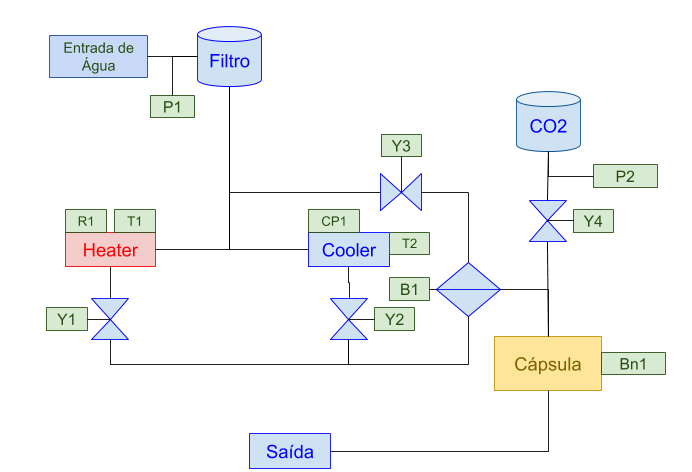
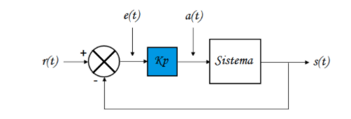
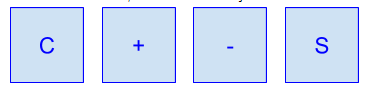

## Projeto Final - Máquina de Bebidas
### Objetivo: 
Desenvolver o firmware de controle para uma máquina de bebidas automática. 
### Princípio de funcionamento: 
Cápsulas com a bebida desejada são inseridas em um compartimento de mistura. Cada cápsula tem uma sequência binária de 3 bits pré definida. A sequência guarda as instruções de preparo da bebida em questão, quantidade de água, de gás carbônico, temperatura, etc…
A máquina pode funcionar como um purificador, refrigerador e gaseificador de água. Avisos no display indicam quando deve ser substituído o filtro de água ou o cilindro de gás carbônico.

### Diagrama de Blocos do Sistema:

O diagrama de blocos do sistema é apresentado na figura 1.

  

Figura 1 - Diagrama de Blocos do Sistema

#### Descrição:
- P1 - Pressostato de filtro de água saturado, contato NF, abre se filtro saturado.
- B1 - Bomba de alimentação de água, saída PWM (0..100%).
- P2 - Pressostato de cilindro de CO2 vazio, contato NF, abre se cilindro vazio.
- Heater: Aquecedor com controle proporcional.
    - R1 - Aquecimento resistivo, saída PWM (0..100%).
    - T1 - Sensor de temperatura analógico, 5..100ºC (5mV/ºC).  
- Cooler: Refrigerador com controle proporcional.
  - CP1 - Compressor de refrigeração, saída PWM (0..10%).
  - T1 - Sensor de temperatura analógico, 5..50ºC (5mV/ºC).  
- Y1 - Válvula de para alimentação de água quente.
- Y2 - Válvula de para alimentação de água gelada.
- Y3 - Válvula de para alimentação de água natural.
- Y4 - Válvula de para alimentação de CO2
- Bn1 - Leitor óptico para detecção do tipo de cápsula:
  - Tipo 1 - Água (Quente, Natural ou Gelada - seleção do usuário).
  - Tipo 2 - Água com Gás
    - 3 seg. com água gelada a 15ºC.
    - 1,5 seg. de CO2 
  - Tipo 3 - Chá Gelado
    - 2,7 seg. com água gelada a 20ºC.
  - Tipo 4 - Chá Quente
    - 2,7 seg. com água quente a 60ºC.
  - Tipo 5 - Refrigerante
    - 4 seg. com água gelada a 17ºC.
    - 2,56 seg. de CO2 

### Importante:
- Todas as misturas que envolvem água e CO2 devem ser iniciadas ao mesmo tempo.
- A bomba de alimentação de água deve seguir um perfil de aceleração/desaceleração do tipo rampa, sendo 0,2 seg. para acelerar e 0,25 seg. para desacelerar.
- Bebidas que necessitam de água gelada ou quente, somente podem iniciar o preparo depois da temperatura desejada ser atingida. 
- Filtro de água saturado impede o preparo de qualquer bebida.
- Cilindro de CO2 vazio impede o preparo de bebidas que necessitam dele.
- Um LED deverá ser utilizado para informar que o sistema está em execução, heart beat de 300ms.

### Controlador:
O controlador utilizado será do tipo Proporcional, neste controlador o sinal de erro, diferença entre o sinal de referência e o sinal de realimentação, é multiplicado pelo ganho proporcional (Kp) e aplicado a saída. 

  

A implementação do controlador deverá levar em conta os limites físicos das saídas (Saturação).
As tarefas de controle devem ser executadas a cada 50 ms. As aquisições das amostras dos sensores de temperatura devem ser realizadas através do DMA. Considere aplicar uma média entre 32 amostras.

Interface Homem-Máquina:
O bloco de interface deve conter um display de LCD 16x2 e 4 botões. A interface deverá apresentar em repouso um relógio digital, contendo Horas, Minutos e Segundos.

Teclado:
C: Cancelar, voltar
+: Navegação de menus e incremento.
-:  Navegação de menus e decremento.
S: Entrar no menu, confirmar alteração.

  

Quando uma cápsula é inserida o display deve mudar automaticamente e mostrar o tipo de cápsula e uma mensagem para iniciar o processo. Caso o usuário confirme o ínicio, a máquina deverá mostrar o status atual, por exemplo: Aquecendo água, temperatura atual, temperatura alvo, misturando, final de processo... 

Caso o usuário cancele o início, a máquina deverá voltar a mostrar o relógio. 
Quando uma cápsula estiver presente na máquina uma mensagem deve indicar isso no display, dessa forma, o usuário pode iniciar o processo quando achar necessário.

Quando o filtro de água estiver saturado, monitorado por P1, uma mensagem de erro deverá ser exibida, o mesmo acontece para o cilindro de CO2, monitorado por P2.

Lembre-se que o tamanho do display é limitado, veja como acomodar as mensagens de forma que fiquem legíveis. 
	
### Resultados: 
Cada aluno deverá entregar:
- Firmware com código modularizado utilizando a IDE STMCube.
- Documentação no formato Doxygen.
- Apresentar a montagem física do sistema.
- Fazer upload do firmware no github, colocar no arquivo README: 
  - Descrição do projeto
  - Estrutura do Menu de navegação.
  - Fotos da montagem prática
- Durante a apresentação será solicitado a inserção de uma nova cápsula com parâmetros fornecidos pelo professor.

Recomendações para o Firmware:
- Divida o código em 'pedaços' que possam ser testados separadamente.
- Fique atento às questões de hardware (pinos PWM, Analógicos, Digitais...).
- Modularizar o código (dividir em arquivos .h e .c)
- Utilize comentários em seções relevantes.
- Procure utilizar a abstração de Máquina de Estados.
- Utilize constantes na criação das telas para o display.
- Processe uma entrada do teclado somente quando necessário ou escolha uma taxa de atualização coerente.
- Utilize estruturas para a implementação das receitas das cápsulas.
